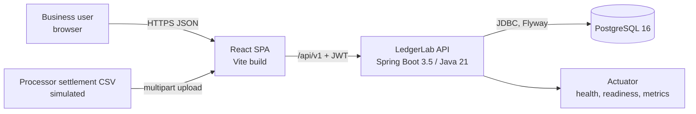

# LedgerLab Architecture

## 1. Scope

LedgerLab is a single-currency (USD) financial transaction and reconciliation platform for
authenticated business users. It is a **modular monolith**: one Spring Boot application, one
PostgreSQL database, one React single-page application. There are no message brokers, no
service mesh, and no cloud dependencies. External parties (the bank that funds deposits and the
card processor that sends settlement files) are deterministic local simulators.

The hard parts of the system are deliberately in the core:

- double-entry accounting with database-enforced invariants,
- an explicit payment state machine,
- PostgreSQL transaction and locking discipline under concurrent requests,
- idempotent mutation APIs,
- multi-tenant isolation and role-based authorization,
- settlement reconciliation.

## 2. System context



## 3. Runtime components

| Component | Technology | Notes |
|-----------|------------|-------|
| API | Spring Boot 3.5, Spring Web MVC, Spring Data JPA, Spring Security (OAuth2 resource server with HMAC JWT), Bean Validation, springdoc-openapi | Stateless; scales horizontally because all coordination happens in PostgreSQL |
| Database | PostgreSQL 16 | Source of truth. Flyway owns the schema. Triggers enforce ledger immutability and balance |
| Frontend | React 19, TypeScript, Vite, React Router, TanStack Query, Tailwind CSS | Served by Vite in development, static build in CI/e2e |
| Local services | Docker Compose (PostgreSQL) | Testcontainers starts disposable PostgreSQL for integration tests |

## 4. Backend module layout

Packages are organized by business capability. Each module owns its tables, entities,
repositories, services and HTTP API. Sub-package `api` holds controllers and DTOs; the module root
holds domain types, application services and repositories.

```text
com.ledgerlab
  shared          errors, problem responses, paging, correlation IDs, idempotency, clock, JSON
  auth            login, JWT issuing/validation, security configuration, current actor
  organization    organizations, users, memberships, roles, admin changes
  account         financial accounts (customer / merchant), balances view
  ledger          ledger accounts, transactions, entries, posting service, integrity checks
  funds           simulated deposits and account-to-account transfers
  payment         payments, state machine, captures, voids, refunds, payment events
  dispute         dispute lifecycle and its accounting
  reconciliation  settlement batches, CSV parsing/validation, matching, results export
  audit           append-only audit events
  dashboard       read-only aggregate summary for the overview page
```

`funds` and `dashboard` are additions to the suggested list: deposits and transfers are not payments
(they have no authorization/capture lifecycle), and the dashboard is a read-only projection that
should not be owned by any single domain module.

### Dependency rules (enforced by ArchUnit tests)

- `ledger` depends only on `shared`. It knows nothing about payments, disputes or accounts'
  business meaning; it accepts balanced posting requests and enforces invariants.
- `account` depends on `ledger` (to create ledger accounts and read balances), `audit`, `shared`.
- `funds`, `payment`, `dispute` depend on `account`, `ledger`, `audit`, `shared`.
- `dispute` may depend on `payment`; `payment` must not depend on `dispute`.
- `reconciliation` depends on `payment` (read-only lookups), `audit`, `shared`.
- No module depends on another module's `api` package.
- Controllers never touch repositories of other modules.

## 5. Request lifecycle

1. `CorrelationIdFilter` reads `X-Correlation-Id` (validated, ≤ 64 safe chars) or generates a UUID,
   stores it in the SLF4J MDC and echoes it on the response.
2. Spring Security validates the bearer JWT (HS256, 15-minute expiry) and maps claims to a
   `CurrentActor(userId, organizationId, role, email)`.
3. Method-level `@PreAuthorize` checks the role for the operation.
4. The controller validates the DTO (Bean Validation), then calls an application service.
5. Mutating services run in a single `@Transactional` boundary that contains: idempotency
   claim → aggregate row lock → domain validation and state transition → ledger posting →
   payment/audit events → idempotency response storage. Any exception rolls back everything.
6. `GlobalExceptionHandler` maps exceptions to RFC 7807 problem responses with a stable
   `code` and the `correlationId`. Stack traces and SQL details are never returned.

## 6. Data consistency and concurrency strategy

The database is the arbiter of correctness. Java-level synchronization is never relied upon.

| Concern | Mechanism |
|---------|-----------|
| Double capture / over-capture / over-refund | `SELECT … FOR UPDATE` on the payment row at the start of the transaction, so operations on one payment serialize. CHECK constraints (`captured ≤ authorized`, `refunded + dispute_lost ≤ captured`) are a backstop. `@Version` on mutable aggregates detects any write that bypassed the lock path. |
| Overdraft under concurrent debits | The posting service locks every affected ledger account with `SELECT … FOR UPDATE` **in ascending UUID order** (prevents deadlocks), checks available balance, then inserts entries. A trigger maintains `ledger_account.balance_minor`, and a CHECK constraint rejects a negative customer/merchant balance even if application code were bypassed. |
| Unbalanced journals | Deferred constraint trigger validates, at commit, that each ledger transaction has ≥ 2 entries, sums to zero, uses one currency, and that only `SIMULATED_DEPOSIT` touches the external clearing account. |
| Immutability | `BEFORE UPDATE OR DELETE` and `BEFORE TRUNCATE` triggers raise errors on `ledger_transaction`, `ledger_entry`, `payment_event`, and `audit_event`. |
| Duplicate requests | Idempotency claim via `INSERT … ON CONFLICT DO NOTHING` inside the business transaction. A concurrent request with the same key blocks on the unique index until the first commits, then replays the stored response (or proceeds if the first rolled back). |
| Lost updates | Pessimistic locks on the hot path plus optimistic `@Version` columns. |

Isolation level: PostgreSQL default `READ COMMITTED`. This is sufficient because each critical
read happens after acquiring a row lock, and READ COMMITTED gives every statement a fresh snapshot,
so the post-lock read observes the competing transaction's committed writes.

## 7. Security model

- Passwords hashed with BCrypt (strength 12 in production, 4 in tests for speed).
- Login issues an HS256 JWT signed with a secret from `LEDGERLAB_JWT_SECRET` (≥ 32 bytes). Claims:
  `sub` (user id), `org` (organization id), `role`, `email`, `iat`, `exp` (15 minutes). No refresh
  tokens in v1; the SPA returns to the login page on 401.
- Roles: `ADMIN` ⊃ `OPERATIONS` ⊃ `VIEWER`. Mutations require `OPERATIONS` or `ADMIN`; membership and
  account-status changes require `ADMIN`; audit events are readable by `OPERATIONS` and `ADMIN`.
- Tenant isolation: every repository lookup includes `organization_id` taken from the token, never
  from the request body. Cross-tenant lookups return `404` so record existence is not leaked.
- Logging: passwords, tokens and `Authorization` headers are never logged. The login failure audit
  event stores the submitted email and a reason code only.
- CORS restricted to the configured frontend origin. CSRF disabled because the API is stateless and
  uses bearer tokens (no cookies).

## 8. Observability

- Logback with a JSON encoder in the `prod` profile and human-readable logs elsewhere; MDC carries
  `correlationId`, `organizationId`, `userId`.
- Actuator: `/actuator/health`, `/actuator/health/liveness`, `/actuator/health/readiness`,
  `/actuator/metrics`, `/actuator/prometheus`.
- Custom Micrometer metrics: `ledgerlab.payments.operations{operation,outcome}`,
  `ledgerlab.idempotency.outcomes{outcome}`, `ledgerlab.reconciliation.results{classification}`.
  HTTP latency and error counts come from Spring's built-in `http.server.requests` timer.

## 9. Testing strategy

| Layer | Tooling | Focus |
|-------|---------|-------|
| Unit | JUnit 5, AssertJ | Money, state machine (every status × action), capture/refund limits, CSV validation, reconciliation classification, accounting plans |
| Property | jqwik | Accounting plans always balance; arbitrary capture/refund sequences never exceed limits |
| Integration | Spring Boot Test + Testcontainers PostgreSQL | Migrations from empty DB, DB triggers, full lifecycle, rollback, idempotency (sequential + concurrent), concurrent capture/refund, tenant isolation, viewer restrictions, reconciliation |
| Randomized model test | JUnit + seeded `Random` against real DB | Random operation sequences, then assert every journal balances and every cached balance equals `SUM(entries)` |
| Architecture | ArchUnit | Module dependency rules |
| Frontend unit | Vitest + Testing Library | Money formatting, API error rendering, role gating |
| End-to-end | Playwright against real backend + PostgreSQL | Critical user journeys |

Integration tests isolate themselves by creating a fresh organization per test instead of
truncating tables (ledger tables reject deletes by design).

## 10. Key decisions and alternatives considered

| Decision | Alternatives | Why |
|----------|--------------|-----|
| Modular monolith | Microservices | The domain needs ACID transactions across payment state and ledger postings. One database transaction is far simpler and more correct than sagas. |
| Signed integer minor units (`bigint`) | `numeric`, `BigDecimal`, float | USD only; integers make sums exact and comparisons trivial. Floats are never used. |
| Trigger-maintained cached balance + CHECK | Pure `SUM()` on read | Gives the database a way to reject overdrafts with a constraint, and makes balance reads O(1). A test and an integrity endpoint verify `balance = SUM(entries)` for every account. |
| Pessimistic row locks for payment operations | Optimistic retry only | Capture/refund contention on the same payment is the exact scenario being protected; locks give deterministic outcomes without retry loops. `@Version` remains as defense in depth. |
| Idempotency record inside business transaction | Separate "in progress" record with TTL | Atomic with the operation: no orphaned in-progress rows, and Postgres unique-index waiting serializes concurrent duplicates naturally. Trade-off: failed (rolled back) requests are not cached, so a retry re-executes validation. |
| HS256 JWT via Spring OAuth2 resource server | Sessions, opaque tokens, RS256 | Stateless and standard. Single service means a symmetric key is acceptable; RS256 would matter if other services verified tokens. |
| Flyway dev seed in a separate location | Seed via application code | Seed data (fixed UUIDs) is plain SQL, only loaded with the `dev`/`e2e` profiles, and the sample CSV files reference those IDs. |

## 11. Risks

| Risk | Mitigation |
|------|-----------|
| Accounting errors (wrong sign, unbalanced journal) | Single documented sign convention; posting plans are pure functions with property tests; DB deferred trigger rejects unbalanced journals. |
| Concurrency bugs | Explicit lock ordering, CHECK constraints, concurrent integration tests with real PostgreSQL. |
| Tenant data leaks | Organization ID only from token; repository methods require it; negative tests per resource type. |
| Hibernate caching stale balances | Balances are read through explicit queries/`FOR UPDATE` selects, and the balance column is not writable through JPA. |
| Scope creep | Vertical slices; only USD; no refresh tokens; simulators instead of integrations. |
