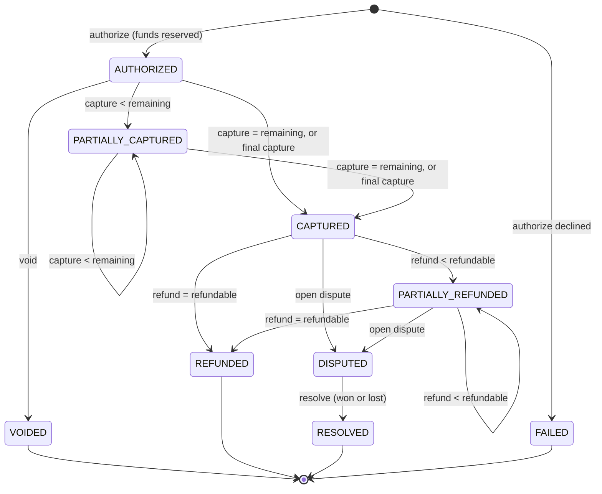

# LedgerLab Domain Model

## 1. Conventions

- **Currency**: USD only. Every monetary column is `bigint` minor units (cents) with a `currency char(3)`
  column fixed to `USD` by CHECK constraint, so multi-currency can be added later without a rewrite.
- **Operation amount limits**: 1 to 100,000,000 minor units ($1,000,000.00) per operation.
- **Identifiers**: UUID v4 generated by the application for all public identifiers.
- **Time**: `timestamptz`, written in UTC from an injectable `Clock`.
- **Deletion**: financial records are never deleted. Accounts change `status`; ledger rows, payment
  events and audit events are append-only (enforced by triggers).

## 2. Ledger sign convention

LedgerLab keeps the books **from the platform's point of view**: the platform holds cash at an
external bank and owes that money to its customers and merchants.

- `ledger_entry.amount_minor` is **signed**: **positive = debit**, **negative = credit**.
- Every ledger transaction's entries sum to exactly **0**.
- `ledger_account.balance_minor` is the raw signed sum of its entries (debit-positive).
- The *presented* balance respects the account's normal side:
  - debit-normal accounts (`ASSET`): presented = `balance_minor`
  - credit-normal accounts (`LIABILITY`): presented = `-balance_minor`

| Account type | Normal side | Increases with |
|--------------|-------------|----------------|
| `ASSET` | Debit | Debit (positive entry) |
| `LIABILITY` | Credit | Credit (negative entry) |

Only these two types are needed for v1 (no fees or revenue). The enum leaves room for `REVENUE`
and `EXPENSE`.

### Ledger account purposes

| Purpose | Type | Owner | Can go below zero? | Meaning |
|---------|------|-------|-------------------|---------|
| `EXTERNAL_CLEARING` | ASSET | Organization (one per org) | Yes (but never does in practice) | Cash received from the simulated external bank |
| `CUSTOMER_AVAILABLE` | LIABILITY | Customer financial account | No | Funds the customer can spend |
| `CUSTOMER_RESERVED` | LIABILITY | Customer financial account | No | Funds held by open authorizations |
| `MERCHANT_AVAILABLE` | LIABILITY | Merchant financial account | No | Funds owed to the merchant |
| `MERCHANT_DISPUTE_HOLD` | LIABILITY | Merchant financial account | No | Merchant funds frozen by an open dispute |

The "cannot go below zero" rule for liabilities means presented balance ≥ 0, i.e.
`balance_minor ≤ 0`. It is enforced by the posting service (with a clear 422 error) and by a CHECK
constraint on `ledger_account` (backstop).

**Accounting equation check**: for every organization,
`EXTERNAL_CLEARING presented balance = Σ presented balances of all liability accounts`. This holds
because only deposits touch the clearing account and every other posting moves value between
liabilities. It is asserted in integration tests and exposed by `GET /api/v1/ledger/integrity`.

## 3. Posting rules (accounting behavior)

Notation: `Dr X` = positive entry on X, `Cr X` = negative entry on X. *A* = amount.

| Operation | Ledger transaction type | Entries |
|-----------|------------------------|---------|
| Simulated deposit to account F | `SIMULATED_DEPOSIT` | Dr `EXTERNAL_CLEARING` A; Cr `F.AVAILABLE` A |
| Authorize payment | `PAYMENT_AUTHORIZATION` | Dr `CUSTOMER_AVAILABLE` A; Cr `CUSTOMER_RESERVED` A |
| Capture *c* (not final) | `PAYMENT_CAPTURE` | Dr `CUSTOMER_RESERVED` c; Cr `MERCHANT_AVAILABLE` c |
| Capture *c*, final, remaining *r* | `PAYMENT_CAPTURE` | Dr `CUSTOMER_RESERVED` c; Cr `MERCHANT_AVAILABLE` c; Dr `CUSTOMER_RESERVED` r; Cr `CUSTOMER_AVAILABLE` r |
| Void | `PAYMENT_VOID` | Dr `CUSTOMER_RESERVED` A; Cr `CUSTOMER_AVAILABLE` A |
| Refund *f* | `PAYMENT_REFUND` | Dr `MERCHANT_AVAILABLE` f; Cr `CUSTOMER_AVAILABLE` f |
| Transfer *t* from S to D | `TRANSFER` | Dr `S.AVAILABLE` t; Cr `D.AVAILABLE` t |
| Open dispute *d* | `DISPUTE_OPENED` | Dr `MERCHANT_AVAILABLE` d; Cr `MERCHANT_DISPUTE_HOLD` d |
| Dispute won by merchant | `DISPUTE_WON` | Dr `MERCHANT_DISPUTE_HOLD` d; Cr `MERCHANT_AVAILABLE` d |
| Dispute lost by merchant | `DISPUTE_LOST` | Dr `MERCHANT_DISPUTE_HOLD` d; Cr `CUSTOMER_AVAILABLE` d |

`F.AVAILABLE` means `CUSTOMER_AVAILABLE` or `MERCHANT_AVAILABLE` depending on account type.

Only `SIMULATED_DEPOSIT` may post to `EXTERNAL_CLEARING`. This is the single place money enters
the system (invariant 6) and is enforced by the posting service and the deferred DB trigger.

### Dispute accounting policy

- Opening a dispute immediately moves the disputed amount from the merchant's available funds into
  `MERCHANT_DISPUTE_HOLD`. If the merchant cannot cover it, the request fails with
  `422 MERCHANT_INSUFFICIENT_FUNDS` (v1 does not allow negative merchant balances).
- **Won** (merchant keeps the money): hold is released back to merchant available.
- **Lost** (chargeback): hold is paid out to the customer's available funds.
- Resolution moves the payment to `RESOLVED`, which is terminal: no further refunds or disputes.
- At most one open dispute per payment (partial unique index).

## 4. Payment state machine



| Action | Allowed from | Result |
|--------|--------------|--------|
| `AUTHORIZE` | (new) | `AUTHORIZED`, or `FAILED` when customer funds are insufficient or the customer account is frozen |
| `CAPTURE` | `AUTHORIZED`, `PARTIALLY_CAPTURED` | `PARTIALLY_CAPTURED`, or `CAPTURED` when fully captured or `final=true` |
| `VOID` | `AUTHORIZED` (no captures yet) | `VOIDED` |
| `REFUND` | `CAPTURED`, `PARTIALLY_REFUNDED` | `PARTIALLY_REFUNDED` or `REFUNDED` |
| `OPEN_DISPUTE` | `CAPTURED`, `PARTIALLY_REFUNDED` | `DISPUTED` |
| `RESOLVE_DISPUTE` | `DISPUTED` | `RESOLVED` |

Every other (status, action) pair is rejected with `409 INVALID_PAYMENT_STATE`. The table is
implemented once in `PaymentStateMachine` and tested exhaustively.

Decisions:

- **Final capture** releases any uncaptured remainder back to the customer in the same journal.
  Without it, a partially captured authorization would hold customer funds forever.
- **Refunds require capture to be complete** (`CAPTURED`/`PARTIALLY_REFUNDED`). A merchant who wants to
  stop capturing marks the last capture as final.
- **Declined authorizations** are persisted as `FAILED` payments with a `failure_code` and no ledger
  activity, so they appear in history and reconciliation. Structural errors (unknown account,
  wrong account type, other organization) are validation errors and create nothing.

### Payment amount invariants

- `0 ≤ captured ≤ authorized`
- `released ≤ authorized − captured` (released = remainder returned by void or final capture)
- `refunded + dispute_lost ≤ captured`
- refundable = `captured − refunded` (and payment must not be disputed/resolved)
- net settled amount (used by reconciliation) = `captured − refunded − dispute_lost`

## 5. Entities

### Identity and tenancy

| Entity | Key fields | Notes |
|--------|-----------|-------|
| `Organization` | id, name, slug, created_at | Tenant boundary |
| `User` | id, email (unique, lower-case), password_hash, display_name, status | Global identity |
| `OrganizationMembership` | id, organization_id, user_id, role, created_at, version | Unique (org, user). Role ∈ ADMIN, OPERATIONS, VIEWER |

### Accounts and ledger

| Entity | Key fields | Notes |
|--------|-----------|-------|
| `FinancialAccount` | id, organization_id, type (CUSTOMER/MERCHANT), name, reference, status (ACTIVE/FROZEN/CLOSED), created_at, version | Product-level account. Unique (org, reference) |
| `LedgerAccount` | id, organization_id, financial_account_id (nullable), purpose, type, normal_side, currency, allow_negative, balance_minor | Balance maintained only by DB trigger |
| `LedgerTransaction` | id, organization_id, type, currency, description, source_type, source_id, posted_at, created_by | Immutable |
| `LedgerEntry` | id, ledger_transaction_id, organization_id, ledger_account_id, amount_minor (≠ 0), currency, created_at | Immutable, signed |

### Money movement

| Entity | Key fields | Notes |
|--------|-----------|-------|
| `Deposit` | id, organization_id, financial_account_id, amount, memo, ledger_transaction_id, created_by, created_at | Simulated external bank deposit |
| `Transfer` | id, organization_id, source_account_id, destination_account_id, amount, memo, ledger_transaction_id, created_by, created_at | Both accounts ACTIVE, same org, different, sufficient funds |
| `Payment` | id, organization_id, customer_account_id, merchant_account_id, reference, description, currency, authorized/captured/released/refunded/dispute_lost amounts, status, failure_code, authorized_at, first_captured_at, version | Product aggregate |
| `PaymentEvent` | id, payment_id, organization_id, type, amount, from_status, to_status, ledger_transaction_id, actor_user_id, created_at | Append-only timeline |
| `Refund` | id, payment_id, organization_id, amount, reason, ledger_transaction_id, created_by, created_at | Successful refunds only (failures roll back) |
| `Dispute` | id, payment_id, organization_id, amount, reason, status (OPEN/WON/LOST), opened_by, opened_at, resolved_by, resolved_at, resolution_note, version | One OPEN per payment |

### Cross-cutting

| Entity | Key fields | Notes |
|--------|-----------|-------|
| `IdempotencyRecord` | id, organization_id, operation, idempotency_key, request_hash (SHA-256), response_status, response_body (jsonb), resource_id, created_at | Unique (org, operation, key) |
| `AuditEvent` | id, organization_id (nullable for unknown-user login failures), actor_user_id, actor_email, action, target_type, target_id, correlation_id, details (jsonb), occurred_at | Append-only |

### Reconciliation

| Entity | Key fields | Notes |
|--------|-----------|-------|
| `SettlementBatch` | id, organization_id, file_name, content_sha256, period_start, period_end, record_count, status (COMPLETED), counts per classification, uploaded_by, uploaded_at | Unique (org, content_sha256) |
| `SettlementRecord` | id, batch_id, organization_id, row_number, processor_record_id, payment_id, status, amount_minor, currency, settled_at | Parsed rows |
| `ReconciliationResult` | id, batch_id, organization_id, settlement_record_id (nullable), payment_id (nullable), classification, expected/actual amount, expected/actual status, message | One per record, plus one per internal payment missing from the file |

## 6. Reconciliation rules

Settlement CSV header (exact, in order):

```text
processor_record_id,payment_id,status,amount_minor,currency,settled_at
```

- `status` is the processor's view of the payment, expressed in LedgerLab's payment statuses.
- `amount_minor` is the net settled amount (`captured − refunded − dispute_lost`).
- The upload also carries a `periodStart`/`periodEnd` (UTC dates, inclusive, ≤ 31 days).

File validation (whole file rejected with `422` and row-level errors): extension `.csv`, size ≤ 1 MB,
≤ 10,000 rows, exact header, non-blank and well-formed values, `currency = USD`, `amount_minor ≥ 0`,
known status, ISO-8601 `settled_at`, and **unique `processor_record_id`** (duplicate rows are a file
error).

Classification, evaluated per row in file order:

1. `DUPLICATE_EXTERNAL` – this `payment_id` already appeared on an earlier row in the file.
2. `MISSING_INTERNAL` – no payment with this id in the organization.
3. `STATUS_MISMATCH` – row status ≠ internal status (checked before amount, because a different
   status usually explains a different amount).
4. `AMOUNT_MISMATCH` – row amount ≠ internal net settled amount.
5. `MATCHED` – otherwise.

After all rows: every internal payment with `captured > 0` whose `first_captured_at` falls inside the
period and that is not referenced by any row becomes `MISSING_EXTERNAL`.

Imports are idempotent twice over: the `Idempotency-Key` header replays the original response,
and identical file content for the same organization is rejected with
`409 DUPLICATE_SETTLEMENT_FILE` (pointing at the existing batch).
